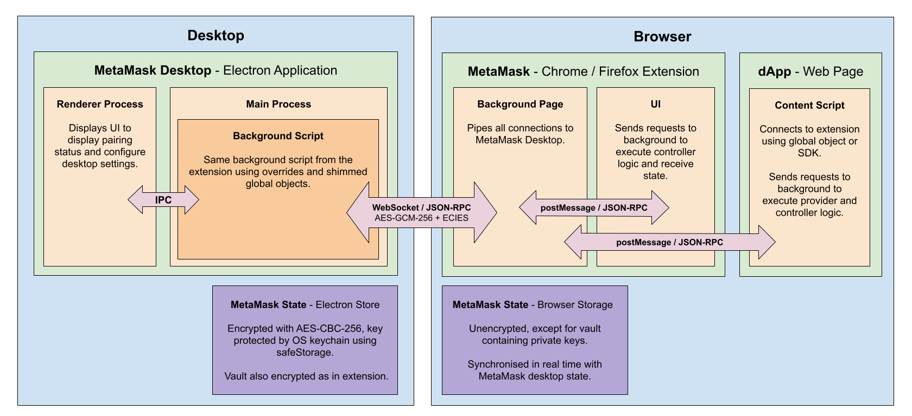

# Architecture

## Diagram

## Overview

The nature of the current MetaMask Desktop is simply to provide an alternate background engine to process the JSON-RPC requests generated by the MetaMask extension UI. This requires calling the various MetaMask controllers but also providing the state required by the UI.

## Submodule

Rather than duplicate all the background and controller logic in the desktop, the same MetaMask extension code is used in MetaMask Desktop via a Git submodule referencing the [metamask-extension](https://github.com/MetaMask/metamask-extension) repository.

The same background script is ultimately executed in MetaMask Desktop in the Electron main process.

### Globals

As the MetaMask extension code is written to be ran in a browser, it often references global objects such as `window`, `document`, and `browserAction`.

In order to avoid changing the MetaMask extension code as much as possible, these global objects are also defined within MetaMask Desktop to perform equivalent operations or to return mock data. See [globals](../packages/app/src/app/globals.ts).

### Node Browser

Some methods still need to be performed in the user's browser, such as displaying a window or changing the extension badge. These method calls are sent to the MetaMask extension to be executed in the real browser, and any return values are sent back to MetaMask Desktop. 

These proxy methods are defined in a whitelist in [node-browser](../packages/app/src/app/browser/node-browser.ts). A second list of unhandled methods is also maintained which simply logs a warning in the console.

## Connections

The core architecture of MetaMask Desktop is how individual connections are made between the MetaMask extension and MetaMask Desktop, so that multiple instances of the extension UI can still be used simultaneously, without coupling the UI to the knowledge that its requests are being resolved by MetaMask Desktop.

### Background Page

In the MetaMask extension, the UI background requests are handled by the background page within the extension.

This is communicated with using the [window.postMessage](https://developer.mozilla.org/en-US/docs/Web/API/Window/postMessage) and [runtime.connect](https://developer.mozilla.org/en-US/docs/Mozilla/Add-ons/WebExtensions/API/runtime/connect) APIs.

### Web Socket Server

All communication with MetaMask Desktop is done using a WebSocket server, powered by [ws](https://github.com/websockets/ws).

When the background connection is first required, a single WebSocket connection is created from the MetaMask extension to MetaMask Desktop, this is abstracted using the [WebSocketStream](../packages/common/src/web-socket-stream.ts) and the required [encryption](encryption.md) is initialised.

Whenever the extension background page receives a new connection, we immediately pipe the UI stream to the WebSocket stream so all requests received by the background page in the extension are forwarded to MetaMask Desktop, and all responses from MetaMask Desktop are ultimately sent back to the extension UI.

The WebSocket server is initialised in the [DesktopApp](../packages//app/src/app/desktop-app.ts) class.

The connection forwarding is done in the extension [background script](../packages//app//submodules//extension/app/scripts/background.js). 

### Multiplex

While paired with MetaMask Desktop, we try to maintain a single WebSocket connection, only creating another if the previous one disconnects for any reason.

In order to differentiate the traffic on the connection, we use a multiplex, powered by [object-multiplex](https://github.com/MetaMask/object-multiplex) which simply wraps any data in a simple JSON object with a specific stream name so it can be filtered at either end but still interacted with as a traditional stream.

Whenever the MetaMask extension UI is opened, it creates a background connection. Multiple connections can exist simultaneously if the fullscreen UI and popup are opened simultaneously for example. Each page containing a dApp also creates an additional connection.

Each of these background connections creates an additional client stream within the multiplex, identified with a UUID. In addition, we required a number of infrastructure steams to communicate with and control the MetaMask extension.

#### Streams

| Stream | Purpose |
| --- | --- |
| browserController | Proxy browser method calls in Node to the browser containing the MetaMask extension. |
| disable | Request the MetaMask extension stop using MetaMask Desktop, and optionally include the final MetaMask state. |
| endConnection | Notify MetaMask Desktop when a background connection is no longer required. |
| newConnection | Notify MetaMask Desktop when a new background connection is required. |
| pairing | Transfer OTP requests and pairing keys to the extension. |
| state | Keep the MetaMask state synchronised between the extension and MetaMask Desktop. |
| version | Verify the MetaMask extension and MetaMask Desktop versions are compatible. |

## State

After connecting to MetaMask Desktop using the WebSocket server, and assuming the authentication process was successful, all of the persisted MetaMask state is transfered to MetaMask Desktop where it is stored in the user's filesystem using [Electron Store](https://github.com/sindresorhus/electron-store).

Further persisted state changes are written to this store, but also sent back to the extension to be persisted to ensure no data is lost in the event of a desktop error.

When disabling MetaMask Desktop from either the extension or the Electron application, the final persisted state is again transferred back to the extension to ensure a clean transition.

## Code

Below are some of the core files in the repository:

### MetaMask Desktop

| File | Overview |
| --- | --- |
| [lavamoat](../packages/app/src/app/lavamoat.ts) | The entry point for MetaMask Desktop when LavaMoat is enabled.   Initialises LavaMoat before running the main script. |
| [main](../packages/app/src/app/main.ts) | The top level domain class. Initialises the desktop app and then the extension background script with desktop specific overrides.   The entry point when LavaMoat is disabled. |
| [globals](../packages/app/src/app/globals.ts) | Shims any global objects not present in Node such as `window` and `document`.   Initialises Sentry to ensure error reporting is available as early as possible. |
| [desktop-app](../packages/app/src/app/desktop-app.ts) | Initialises the Electron application, including windows and events.   Creates the WebSocket server.   Creates `ExtensionConnection` instances for each WebSocket connection.
| [extension-connection]() | Responsible for all communication with the MetaMask extension.   Initialises the multiplex and all related streams.

### MetaMask Extension

| File | Overview |
| --- | --- |
| [desktop-manager](../packages/common/src/desktop-manager.ts) | The container class that aims to encapsulate all desktop logic in the MetaMask extension.  Connects and maintains the connection to the WebSocket server in MetaMask Desktop. |
| [desktop-connection](../packages/common/src/desktop-connection.ts) | Responsible for all communication with MetaMask Desktop.   Initialises the multiplex and all related streams.   The inverse of `extension-connection` in MetaMask Desktop. |