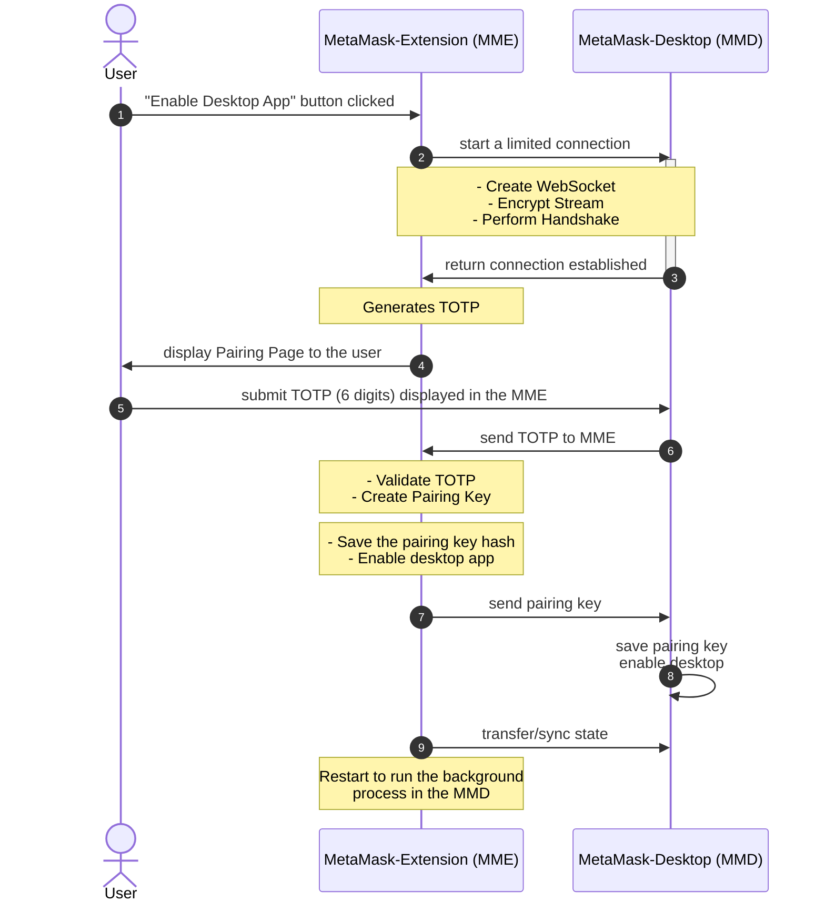

# TOTP Pairing Flow

## Diagram

Here is a simple flow chart using [mermaid](https://mermaid.live/):

## Overview

All starts on the MetaMask extension side whenever a user clicks `Enable Desktop App` in Settings>Experimental.

The MetaMask extension connects with MetaMask Desktop via a [WebSocket](./encryption.md#communication). Once the streams are created and the handshake is completed, a 6 digit TOTP is displayed.

The `SHA1` based TOTP is refreshed every 30 seconds and is generated by [OTPAuth](https://github.com/hectorm/otpauth).

Every 5 TOTP attempts the secret is renewed.

After the user enters the 6 digits and the TOTP is [validated](../packages/common/src/pairing.ts) by the MetaMask extension:

- A pairing key is generated and sent to MetaMask Desktop.
- Desktop mode is enabled in the extension.
- The hash of the pairing key is saved in the extension state.

Once the pairing is completed, whenever a new connection occurs, the extension waits for the desktop pairing key, hashes it, and checks if it matches the stored hash before establishing the authorised connection and transfering the current MetaMask state.

Once the authorised connection is active, the state is continuously synchronised between MetaMask Desktop and the MetaMask extension whenever the persisted state is updated.
