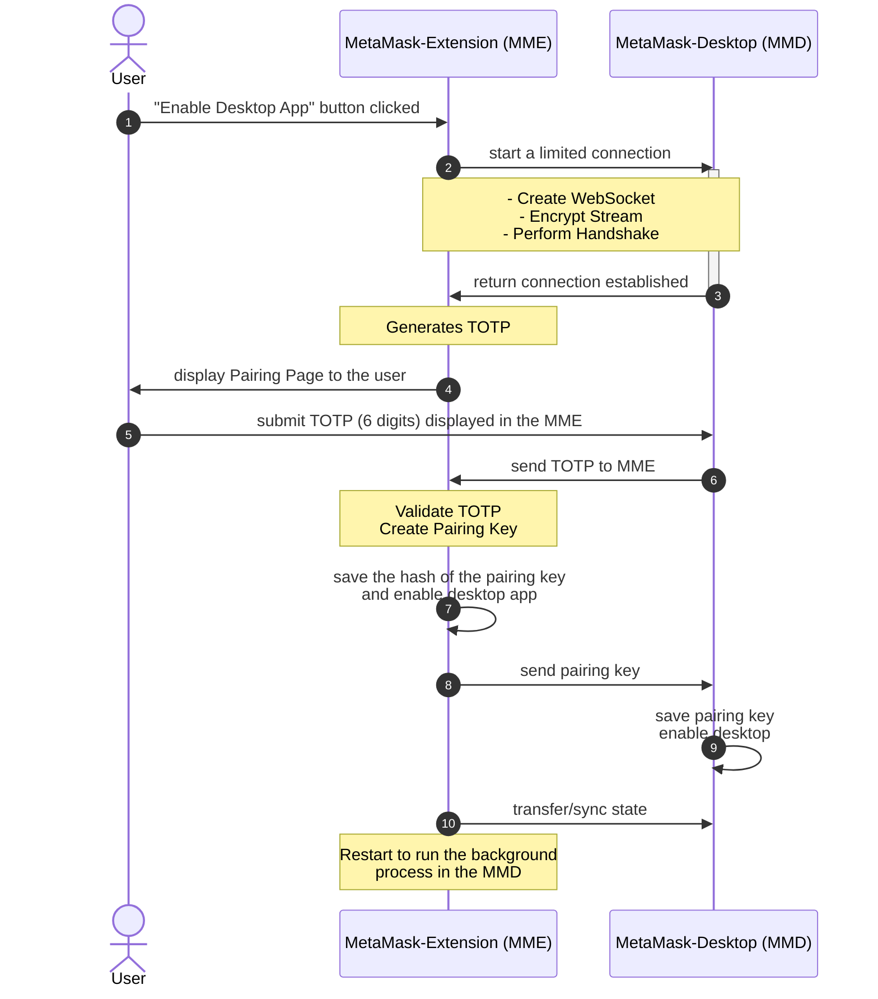

# TOTP Pairing Flow

## Diagram

Here is a simple flow chart using [mermaid](https://mermaid.live/):

## Overview

All starts on the MetaMask extension side whenever a user clicks `Enable Desktop App` in Settings>Experimental.

The MetaMask extension connects via [WebSockets](./encryption.md#communication) with the desktop app and once the streams are created and the handshake performed a 6 digits TOTP using `SHA1` refreshed every 30 seconds and provided by [OTPAuth](https://github.com/hectorm/otpauth) is displayed.

Every 5 TOTP attempts the secret is renewed.

The user submits the 6 digits and once [TOTP is validated](../packages/common/src/pairing.ts) by the MetaMask Extension a pairing key is generated using AES-GCM with a 256-bit, send to the desktop app alongside a boolean to enable desktop and saved the pairing key hash into the Metamask extension. 

After the pairing is concluded whenever the connection starts the extension waits for the desktop pairing key, hashes it and checks if it matches with the hash of the pairing key stored in the extension before establishing the connection and syncing the state.

Once the connection is active, the state is constantly synced between the desktop app and the extension.
